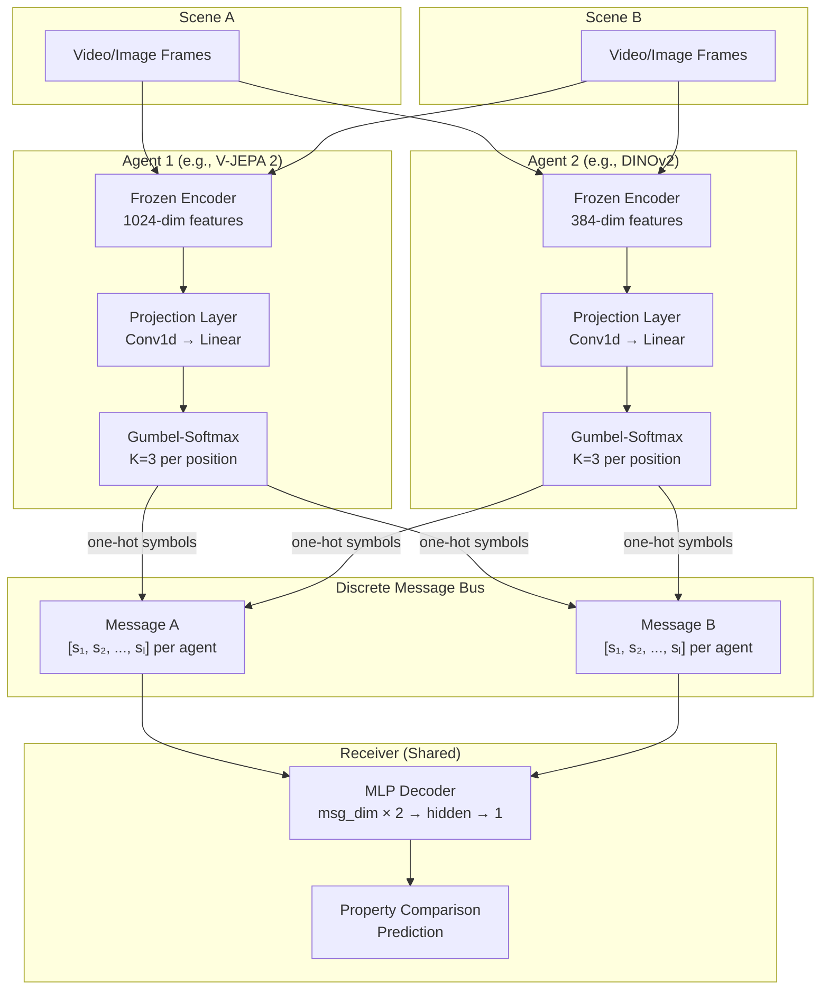
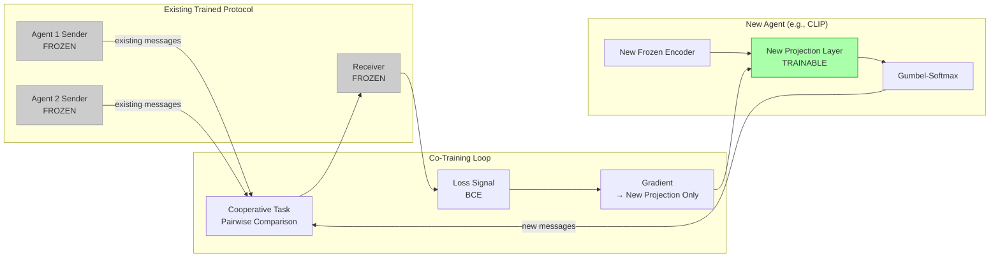
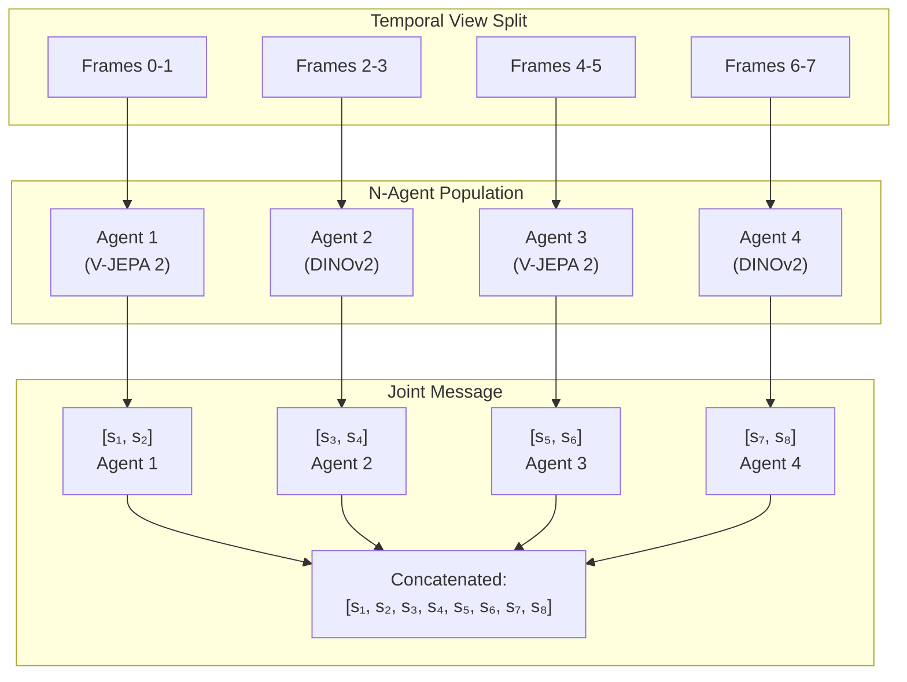

# WMCP Architecture

## Communication Loop

The full communication round for a pairwise comparison task between two scenes:



### Data Flow Detail

1. **Feature extraction:** Frozen encoder processes video frames → continuous features (B, T, D).
2. **Temporal encoding:** Conv1d over time dimension → pooled representation (B, 128).
3. **Head projection:** Independent linear heads per message position → logits (B, K) per position.
4. **Discretization:** Gumbel-Softmax (training) or argmax (inference) → one-hot symbol per position.
5. **Message assembly:** Concatenate all agent symbols → joint message vector.
6. **Decoding:** Receiver MLP takes message pair (scene A, scene B) → comparison logit.

## Onboarding Flow

How a new encoder joins an existing trained protocol:



### Onboarding Steps

1. Freeze all existing agent senders and the receiver.
2. Initialize new projection layer with random weights.
3. Co-train the new projection layer using the existing cooperative task.
4. The new agent learns to produce messages compatible with the existing protocol.
5. Convergence: 50 training steps to reach 90% of base accuracy (Phase 104, 10/10 seeds).

## Multi-Agent Topology



### Topology Notes

- Each agent observes a **different temporal window** of the same scene.
- Agents produce messages **independently** — no inter-agent communication during encoding.
- The joint message is the **concatenation** of all agent messages.
- Heterogeneous populations alternate architectures: agents 0, 2 use architecture A; agents 1, 3 use architecture B.
- For 3-architecture populations: agents cycle through architectures (A, B, C, A, B, C, ...).
- The receiver sees only the joint message — it has no information about which agent produced which symbol positions.

## Encoder Compatibility Matrix

Based on experimental validation (Phase 96, K=3, 2-agent, 10 seeds):

```
                V-JEPA 2    DINOv2    CLIP ViT-L/14
V-JEPA 2         0.777       0.764       0.737
DINOv2           0.764       0.661       0.657
CLIP ViT-L/14    0.737       0.657       0.547
```

Values are mean PosDis. All pairings achieve PosDis > 0.5 (certification threshold). Pairings with V-JEPA 2 consistently achieve the highest compositionality due to its temporal physics-encoding features.
